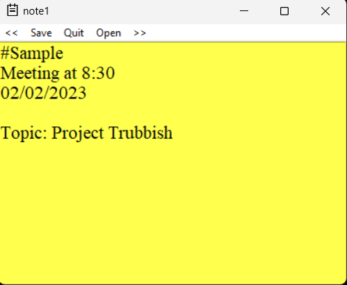

# Switchit

Switchit is a simple sticky notes app built using Python's Tkinter library that allows you to open, edit, and save text files in a given directory. It provides basic functionalities such as navigating between multiple text files, saving changes, and quitting the application.

## Prerequisites

Make sure you have Python installed on your system to run this text editor. The code is written in Python 3.x.

You also need to install tkinter package using the command in cmd
```
pip install tkinter
```

## Getting Started

1. Clone or download the code files from the repository.

2. Run the "main.pyw" file using Python. This will launch Switchit.

3. Select the directory where your notes(.txt files) are present.

## Features

1. **Open File:** Click on the "Open" option in the menu bar to select a text file from your system. The selected file's content will be displayed in the text editor.

2. **Save File:** Click on the "Save" option in the menu bar to save the changes made in the currently opened file. If the file was previously saved, it will overwrite the existing content. If it is a new file, it will create a new text file in the current working directory.

3. **Next File (>>):** Click on ">>" in the menu bar to open the next text file in the directory. If you are at the last file in the list, it will loop back to the first file.

4. **Previous File (<<):** Click on "<<" in the menu bar to open the previous text file in the directory. If you are at the first file in the list, it will loop back to the last file.

5. **Quit:** Click on "Quit" in the menu bar to close the text editor application.

## How to Use

1. When you run Switchit it will prompt you to select a directory. Choose a directory where your text files are located.

2. If there are no text files in the chosen directory, a temporary file named "temp.txt" will be created.

3. Once the text editor is open, you can use the menu options to navigate between different text files and save your changes as needed.

4. The text editor supports basic text editing functionalities such as typing, deleting, and selecting text.

5. You can close the text editor window by clicking the close button (X) on the window or selecting "Quit" from the menu bar.

## Notes

- The text editor uses the Tkinter file dialog to open and save files.

- The application window is resizable, allowing you to adjust the size as per your preference.

## About

This text editor was created as a simple project to demonstrate the usage of Python's Tkinter library for GUI applications. It is intended for educational and learning purposes.

Feel free to modify and enhance this code as per your requirements. If you encounter any issues or have suggestions for improvements, please feel free to contribute to the project. Happy coding!

If anyone wants a .exe version that runs without requiring Python contact me at ayushsharma14@gmail.com

This is a screenshot of the UI

